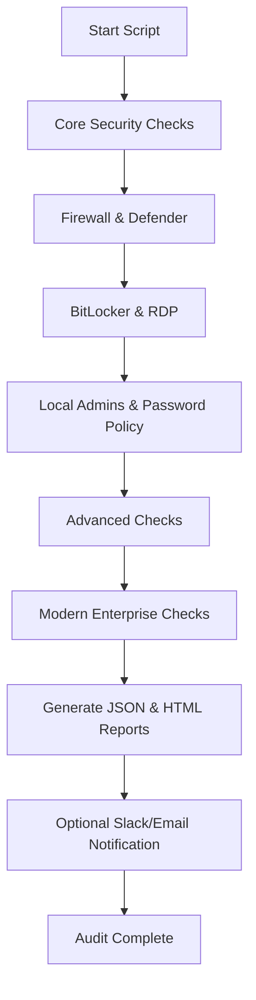

# 🛡️ Modern Security Audit Framework

**Author:** Syed Shaheer Hussain

**Version:** 3.0

**License:** MIT License

**Technologies:** PowerShell, Windows Security APIs, WMI, COM, REST, HTML/JSON Reporting

## 📄 One-Line Description

A **comprehensive Zero-Trust security auditing framework** for Windows, automating system, network, and policy checks with advanced threat detection, reporting, and remediation guidance.

## 🧠 Introduction

`Audit Framework` is a **modern, enterprise-ready PowerShell script** for auditing Windows environments using Zero-Trust principles.
It integrates **classic system checks** with **advanced features**:

* MFA audit
* Attack Surface Reduction rules
* PowerShell logging
* Disk & sensitive file scanning
* EDR & threat protection detection
* TLS & browser security audits
* Automated JSON & HTML reporting

**Goal:** Save IT/security teams time while improving visibility of security posture.

## ⚡ Features Overview

| Feature                | Description                                    | Risk                            |
| ---------------------- | ---------------------------------------------- | ------------------------------- |
| Firewall Audit         | Checks all profiles, ensures enabled           | High if disabled                |
| Defender RTP           | Detects real-time protection                   | High if off                     |
| BitLocker              | Detects C: drive encryption                    | High if off                     |
| RDP                    | Checks remote access                           | Medium if enabled unnecessarily |
| Local Admins           | Detects too many privileged accounts           | Medium                          |
| Password Policy        | Minimum length & complexity                    | Medium                          |
| ASR/ExploitGuard       | Attack Surface Reduction rules                 | High if missing                 |
| MFA / Remote Admin     | MFA enforcement for admin & remote             | High if missing                 |
| PowerShell Logging     | Checks transcription & constrained mode        | Medium if off                   |
| Windows Updates        | Patch status & missing updates                 | Medium if outdated              |
| Local GPO Policies     | Security policies & lockouts                   | Low/Medium                      |
| Disk & Sensitive Files | Scans for `.key/.pem/.pfx`                     | High if sensitive files exposed |
| EDR Detection          | Detects SentinelOne, CrowdStrike, Defender ATP | Medium/High                     |
| Browser & TLS          | Ensures TLS 1.2+, secure browser config        | High if TLS <1.2                |

## 🏗️ Installation & Running

### 1️⃣ Clone Repo / Download

```powershell
git clone https://github.com/SyedShaheerHussain/Security-Audit-Framework-Shell

```
```
cd ZeroTrustAudit

```

### 2️⃣ Set Execution Policy

```powershell
Set-ExecutionPolicy RemoteSigned -Scope CurrentUser
```

### 3️⃣ Run Script

```powershell
.\ZeroTrustAudit.ps1

```
# Optional flags
```
.\ZeroTrustAudit.ps1 -Remediate -EmailReport -SlackNotify
```

## 🗂️ File Structure

```
ZeroTrustAudit/
├── ZeroTrustAudit.ps1       # Main audit script
├── AuditReports/            # JSON & HTML reports output
├── README.md                # Project documentation
├── .gitignore               # Ignore audit outputs
└── LICENSE                  # MIT License
```

## 🌀 Flow of Execution



## 💡 Feature Explanations

### `Add-Result`

* **Purpose:** Centralizes audit findings
* **Example:**

```powershell
Add-Result "Firewall" "Public profile disabled" "Fail" "High" "Enable firewall"

```

* **Real-Life:** Aggregates all results in JSON/HTML report

### `Check-ASRAndExploitGuard`

* **Purpose:** Checks ASR rules
* **Example:** Detects missing ASR → Risk: High → Action: Enable recommended rules
* **Real-Life:** Prevents ransomware, malware, or malicious script execution

### `Check-MFAAndRemoteAdmin`

* **Purpose:** Ensures MFA for remote/admin accounts
* **Example:** MFA not enforced → Risk: High → Action: Enforce MFA
* **Real-Life:** Prevents stolen credentials attacks

*(Other functions similar logic: Disk scan, EDR, TLS, PowerShell logging…)*

## ⚠️ Caution & Notes

>[!caution]
> * Run **as Administrator** for complete audit
> * Test on non-production systems before deployment
> * Slack/Email notifications require configured credentials/webhooks
> * Some WMI/COM calls may return **“Not Applicable”** if restricted

## 📢 Slack/Teams Integration

* Optional notification to a team channel when audit completes
* Requires webhook URL in `Send-SlackNotification` function

```powershell
Send-SlackNotification -WebhookUrl "https://hooks.slack.com/services/XXX/XXX/XXX"

```

## 📝 Author & License

>[!note]
> **Author:** Syed Shaheer Hussain
> **License:** MIT – Free to use, modify, and distribute with attribution

## 🌟 Why This Exists

* Streamline **Zero Trust audits** for Windows
* Combine **classic & modern enterprise security checks** in one script
* Enable **automated reporting & remediation guidance**

## 🧩 What I Learned

* Advanced PowerShell scripting
* WMI, CIM, COM interfaces
* Generating JSON & HTML programmatically
* Slack/Teams API integration
* Enterprise audit thinking

## 🚀 Future Enhancements

* AI-based automated remediation suggestions
* Integration with SIEM (Splunk, Sentinel)
* Scheduled automated scans via Task Scheduler
* Cross-platform Zero Trust checks (macOS/Linux)
* Interactive HTML dashboards with charts

## 🏷️ Tags & Metadata

**Tags:** #PowerShell #WindowsSecurity #ZeroTrust #Audit #EDR #MFA #BitLocker #Firewall #PatchManagement #EnterpriseSecurity

**Hashes / Checksum:** SHA256 verification for script integrity recommended

## 📊 Real-Life Usage Example

### Run full audit and remediate basic issues
```
.\ZeroTrustAudit.ps1 -Remediate -EmailReport -SlackNotify

```

* Generates JSON & HTML reports
* Sends optional Slack notification
* Remediates simple issues automatically

## ⚙️ How, When, Where, Why

* **How:** PowerShell script with optional flags for remediation/notification
* **When:** Anytime a Windows system needs a security audit
* **Where:** Windows endpoints, servers, labs
* **Why:** Improve security posture, prevent breaches, ensure compliance
